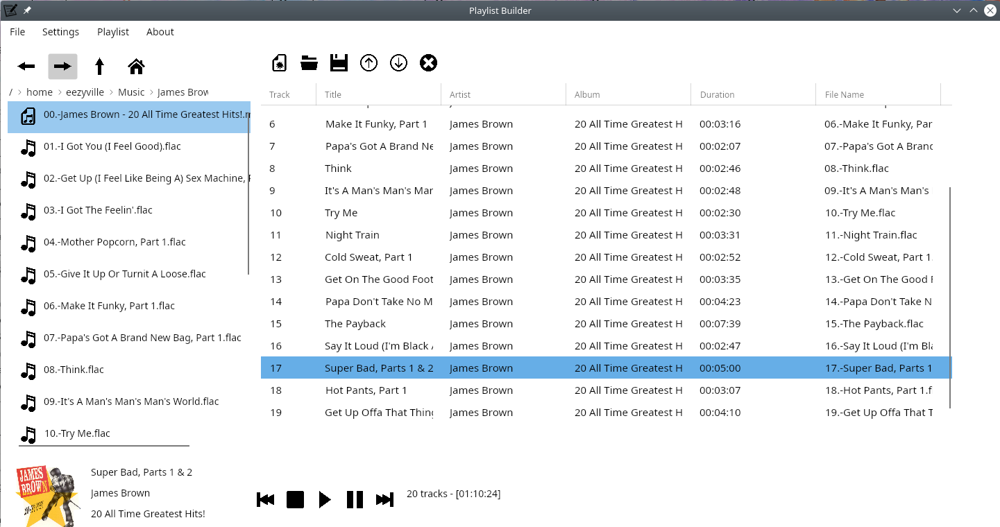

# Playlist Builder

## Introduction

This program was create to be a simple playlist builder. I recently got an mp3 player and didn't really like using the full scale media manager programs available in Linux. There was really no need for all the bells and whistles just to organize a playlist. I also had some problems with creating playlists in Windows and using them in Linux. 

This project was created to scratch that itch of mine. The process of building it taught me more in C# GUI development as well as helped me discover some incredible C# libraries. 

#### Technologies:

- [.Net 7](https://dotnet.microsoft.com/en-us/download/dotnet/7.0)
- [Avalonia](https://github.com/AvaloniaUI/Avalonia) 11.0.2
- [Serilog](https://serilog.net/) 3.0.2
- [Xunit](https://xunit.net/) 2.5.1
- [LibVLCSharp](https://github.com/videolan/libvlcsharp) 3.7.0
- [ATL.Net](https://github.com/Zeugma440/atldotnet) 4.36.0

#### Launch:

In the PlaylistBuilder.GUI directory open a terminal and type the following code:

```
dotnet restore
dotnet run
```

I will build executables at a later date.

#### Usage:

The program is pretty straight forward. The main window is shown below:



The left is a list view of the current working directory. It will start in your music directory. Double clicking a 
folder will move you to that folder. Double clicking a playlist will clear the current playlist and import the new one. 
Double clicking a music file will add the file to the current playlist. You can rearrange items in the playlist using 
the up and down arrows. You can also save the playlist as m3u, pls, and xspf files. The playlist will default to 
relative paths however you can save to absolute by changing the radio buttons in the Settings -> Preference window. The 
Playlist menu allows you shuffle, de-dupe, and remove unavailable media items from the playlist.

#### What needs work?

Currently I have no way to navigate to network drives. I would also like to have multiple playlists in a tabbed display.
There are a few more features I'd like to add as well as improve UI/UX.

#### License:

This project is license under the terms of the AGNU GPLv3 License.